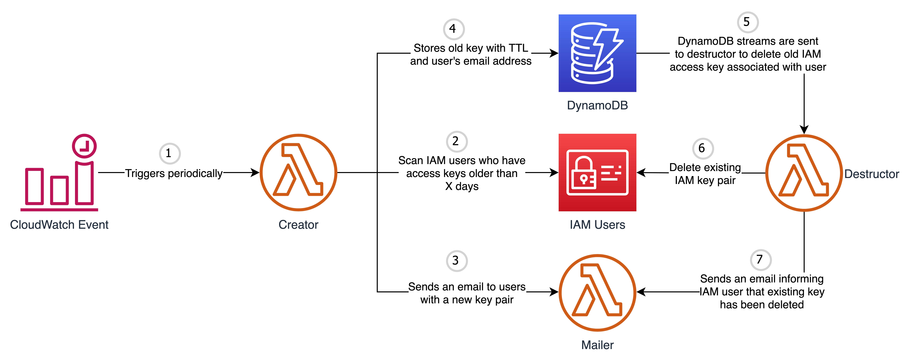

## aws-iam-key-rotator

   

This tool is responsible for generating a new IAM access key pair every X days and mails it to the user via SES. It will also delete the existing key pair after a few days of new key generation to allow the user to update the new key wherever required.

### Prerequisites:
- [Terraform](https://www.terraform.io/downloads.html)
- [AWS CLI](https://aws.amazon.com/cli/)

### AWS Services Involved:
- Lambda
- DynamoDB
- SES
- CloudWatch Event
- IAM

### Process:

- CloudWatch triggers lambda function which checks the age of access key for all the IAM users who have **Email**(case-insensitive) tag attached.
- If existing access key age is greater than `ACCESS_KEY_AGE` environment variable or `ROTATE_AFTER_DAYS` tag associated to the IAM user and if the user ONLY has a single key pair associated a new key pair is generated and the same is mailed to the user via your selected mail service.
- The existing access key is than stored in DynamoDB table with user details and an expiration timestamp.
- DynamoDB stream triggers destructor lambda function which is responsible for deleting the old access key associated to IAM user if the stream event is `delete`.
- In case it fails to delete the existing key pair the entry is added back to the DynamoDB table so that the same can be picked up later for retry.

### Setup:
- Use the [terraform module](terraform) included in this repo to create all the AWS resources required to automate IAM key rotation
- Add following tags to the IAM user whose access keys needs to be automated. All the tags mentioned are case-insensitive:
  - `ROTATE_AFTER_DAYS`: After how many days access key should be rotated
  - `NOTIFICATION_CHANNEL`: Channel to use for notifying user about access key change. Supported Values: `email` and `slack`
  - `EMAIL`: Email address to which alerts related to access keys needs to be sent. **Note:** Required only if channel is set to `email`
  - `SLACK_URL`: Slack incoming webhook url to use for notification. **Note:** Required only if channel is set to `slack`
